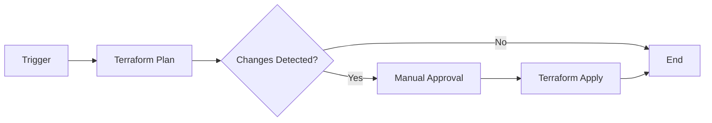
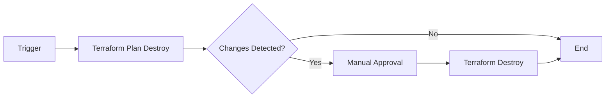
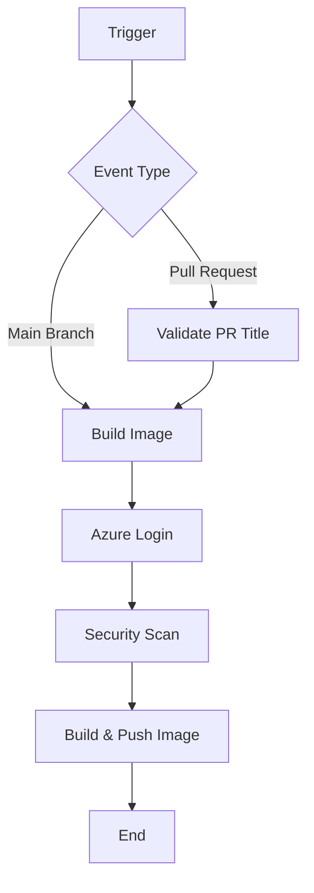
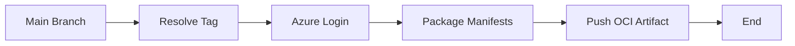
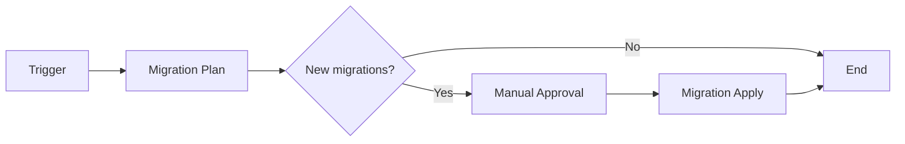

<div align="center">

# 🚀 Pipeline Templates

### Reusable GitHub Actions Workflows for Azure Infrastructure & Container Deployments

[](https://github.com/features/actions)
[](https://www.terraform.io/)
[](https://www.docker.com/)
[](https://azure.microsoft.com/)

**Production-ready workflows for Terraform automation, container builds, and Kubernetes manifest management**

[Features](#-features) • [Workflows](#-workflows) • [Quick Start](#-quick-start) • [Examples](#-usage-examples) • [Contributing](#-contributing)

</div>

---

## 📋 Table of Contents

- [✨ Features](#-features)
- [🔧 Workflows](#-workflows)
  - [Terraform Reusable Workflow](#1-terraform-reusable-workflow)
  - [Terraform Destroy Workflow](#2-terraform-destroy-workflow)
  - [Container Build & Push Workflow](#3-container-build--push-workflow)
  - [Semantic Release Workflow](#3a-semantic-release-workflow)
  - [OCI Manifest Push Workflow](#4-oci-manifest-push-workflow)
  - [EF Core Migrations Workflow](#5-ef-core-migrations-workflow)
  - [Dependency Submission Workflow](#6-dependency-submission-workflow)
- [🚀 Quick Start](#-quick-start)
- [📚 Usage Examples](#-usage-examples)
- [🔐 Security](#-security)
- [📋 Prerequisites](#-prerequisites)
- [🤝 Contributing](#-contributing)
- [📄 License](#-license)

---

## ✨ Features

<table>
<tr>
<td width="50%">

### 🏗️ Infrastructure as Code
- ✅ Automated Terraform planning & applying
- ✅ Azure backend state management
- ✅ Manual approval gates for production
- ✅ Format validation & automated checks
- ✅ Safe infrastructure destruction

</td>
<td width="50%">

### 🐳 Container Automation
- ✅ Multi-architecture Docker builds
- ✅ Semantic versioning with auto-releases
- ✅ Security scanning with Trivy
- ✅ Azure Container Registry integration
- ✅ OCI artifact support for K8s manifests

</td>
</tr>
</table>

---

## 🔧 Workflows

### 1️⃣ Terraform Reusable Workflow

**File:** `.github/workflows/terraform-reusable.yml`

A comprehensive workflow for managing infrastructure with Terraform, featuring automated planning, manual approval gates, and secure Azure authentication.

<details>
<summary>📖 <b>Click to expand details</b></summary>

#### 🎯 Purpose
Automate Terraform infrastructure deployment with safety controls and Azure integration.

#### 📊 Workflow Diagram

```mermaid
graph LR
    A[Trigger] --> B[Terraform Plan]
    B --> C{Changes Detected?}
    C -->|Yes| D[Manual Approval]
    C -->|No| E[End]
    D --> F[Terraform Apply]
    F --> E
```

#### 🔑 Key Features
- **Automated Planning**: Validates and plans infrastructure changes
- **Format Checking**: Ensures Terraform code follows best practices
- **Manual Approval**: Requires human approval before applying changes
- **State Management**: Uses Azure Storage for remote state
- **OIDC Authentication**: Secure Azure authentication without static credentials

#### 📥 Inputs

| Input | Required | Default | Description |
|-------|----------|---------|-------------|
| `terraform_directory` | ✅ | `.` | Path to Terraform configuration |
| `terraform_version` | ❌ | `latest` | Terraform CLI version |
| `args` | ❌ | `""` | Extra arguments for terraform plan |
| `environment_name` | ❌ | `Production` | GitHub environment for approval |
| `backend_state_file` | ❌ | - | Custom state file name |

#### 🔒 Secrets

| Secret | Required | Description |
|--------|----------|-------------|
| `AZURE_CLIENT_ID` | ✅ | Azure service principal client ID |
| `AZURE_TENANT_ID` | ✅ | Azure AD tenant ID |
| `AZURE_SUBSCRIPTION_ID` | ✅ | Target Azure subscription ID |
| `AZURE_BACKEND_RESOURCE_GROUP` | ✅ | Resource group for state storage |
| `AZURE_BACKEND_STORAGE_ACCOUNT` | ✅ | Storage account for state |
| `AZURE_BACKEND_CONTAINER` | ✅ | Blob container for state files |
| `REPO_PAT` | ❌ | PAT for ArgoCD repo access |

#### 🎬 Jobs Flow
1. **Terraform Plan** - Validates, formats, and plans changes
2. **Manual Approval** - Awaits human approval (only on main branch with changes)
3. **Terraform Apply** - Applies approved changes

</details>

---

### 2️⃣ Terraform Destroy Workflow

**File:** `.github/workflows/terraform-destroy.yml`

Safely destroy Terraform-managed infrastructure with the same safety controls as deployment.

<details>
<summary>📖 <b>Click to expand details</b></summary>

#### 🎯 Purpose
Provide a controlled way to tear down infrastructure with approval gates.

#### 📊 Workflow Diagram

```mermaid
graph LR
    A[Trigger] --> B[Terraform Plan Destroy]
    B --> C{Changes Detected?}
    C -->|Yes| D[Manual Approval]
    C -->|No| E[End]
    D --> F[Terraform Destroy]
    F --> E
```

#### 🔑 Key Features
- **Safe Destruction**: Plans destroy operation before executing
- **Manual Approval**: Requires approval before destroying resources
- **State Preservation**: Maintains state file throughout process
- **Same Inputs/Secrets**: Uses identical configuration as apply workflow

#### 📥 Inputs & Secrets
Same as [Terraform Reusable Workflow](#1-terraform-reusable-workflow)

</details>

---

### 3️⃣ Container Build & Push Workflow

**File:** `.github/workflows/container-workflow.yml`

Build, scan, and push Docker images. Semantic versioning is supplied by the upstream `semantic-release-reusable.yml` (see §3a) so multiple parallel container jobs in the same pipeline share one release.

<details>
<summary>📖 <b>Click to expand details</b></summary>

#### 🎯 Purpose
Automate Docker image lifecycle from build to registry with security checks. Receives the semantic version from a single upstream release job; never runs semantic-release itself.

#### 📊 Workflow Diagram

```mermaid
graph TD
    A[Trigger] --> B{Event Type}
    B -->|Pull Request| C[Validate PR Title]
    B -->|Main Branch| D[Build Image]
    C --> D
    D --> E[Azure Login]
    E --> F[Security Scan]
    F --> G[Build & Push Image]
    G --> H[End]
```

#### 🔑 Key Features
- **Semantic Tags from Upstream**: Consumes `release_version` input from the upstream `semantic-release-reusable.yml`; tags image with full + major.minor + major semver when provided
- **Security Scanning**: Trivy vulnerability scanning on PRs
- **Multi-Tag Strategy**: Generates SHA, branch and (when a release is published) semver tags
- **PR Validation**: Ensures PR titles follow conventional commit format
- **Vulnerability Reports**: Posts scan results as PR comments

#### 📥 Inputs

| Input | Required | Default | Description |
|-------|----------|---------|-------------|
| `context` | ❌ | `.` | Build context path |
| `dockerfile` | ✅ | - | Path to Dockerfile |
| `image_name` | ✅ | - | Container image name |
| `registry_name` | ✅ | - | Azure Container Registry name |
| `release_branch` | ❌ | `main` | Branch on which images get pushed |
| `vulnerability_threshold` | ❌ | `HIGH,CRITICAL` | Severity levels surfaced in the PR scan summary (informational; scan does not fail the build) |
| `environment_name` | ❌ | `Production` | GitHub environment name |
| `release_version` | ❌ | `""` | Semver string from the upstream `semantic-release-reusable.yml` job's output. Empty = no semver tags get added. |
| `release_published` | ❌ | `"false"` | `'true'` when the upstream release job published a new release. |

#### 🔒 Secrets

| Secret | Required | Description |
|--------|----------|-------------|
| `AZURE_CLIENT_ID` | ✅ | Azure service principal client ID |
| `AZURE_TENANT_ID` | ✅ | Azure AD tenant ID |
| `AZURE_SUBSCRIPTION_ID` | ✅ | Azure subscription ID |
| `REPO_PAT` | ✅ | Consumed only by the PR-title validator (`amannn/action-semantic-pull-request`). |

#### 📦 Outputs

| Output | Description |
|--------|-------------|
| `image_digest` | Docker image digest |

#### 🔒 Security Features
- **Trivy Scanning**: Scans for OS and library vulnerabilities
- **Configurable Severity Filter**: Choose which vulnerability levels appear in the PR summary
- **SARIF Reports**: Structured vulnerability reporting
- **PR Comments**: Automated security summaries (informational; the scan does not fail the build)

</details>

---

### 3️⃣a Semantic Release Workflow

**File:** `.github/workflows/semantic-release-reusable.yml`

Runs `semantic-release` exactly once per push to the release branch and emits the resolved version. Pair with `container-workflow.yml` so multiple parallel container build jobs in the same pipeline share one release (no `refs/notes/semantic-release-*` push races).

<details>
<summary>📖 <b>Click to expand details</b></summary>

#### 🎯 Purpose
Single source of truth for the per-push semantic version. A repo-keyed `concurrency` group serializes any accidental duplicate invocations so the per-version git note push can't race itself.

#### 📥 Inputs

| Input | Required | Default | Description |
|-------|----------|---------|-------------|
| `release_branch` | ❌ | `main` | Branch that triggers semantic-release |

#### 🔒 Secrets

| Secret | Required | Description |
|--------|----------|-------------|
| `REPO_PAT` | ✅ | GitHub PAT semantic-release uses to push tags, releases, and the per-version git note |

#### 📦 Outputs

| Output | Description |
|--------|-------------|
| `release_version` | Semver string (e.g. `1.2.3`). Empty when no release was published. |
| `release_published` | `'true'` when a new release was published on this run, else `'false'`. |

#### Wiring

A caller's `automation.yaml`:

```yaml
jobs:
  release:
    needs: unit_tests
    uses: amirpouyan-haghighat/pipeline-templates/.github/workflows/semantic-release-reusable.yml@main
    secrets: inherit

  container_api:
    needs: [unit_tests, release]
    uses: amirpouyan-haghighat/pipeline-templates/.github/workflows/container-workflow.yml@main
    with:
      dockerfile: Dockerfile.api
      image_name: my-api
      registry_name: niftroxacr
      release_version: ${{ needs.release.outputs.release_version }}
      release_published: ${{ needs.release.outputs.release_published }}
    secrets: inherit

  container_worker:
    needs: [unit_tests, release]
    uses: amirpouyan-haghighat/pipeline-templates/.github/workflows/container-workflow.yml@main
    with:
      dockerfile: Dockerfile.worker
      image_name: my-worker
      registry_name: niftroxacr
      release_version: ${{ needs.release.outputs.release_version }}
      release_published: ${{ needs.release.outputs.release_published }}
    secrets: inherit
```

#### When to use this reusable vs leaving release inline

`container-workflow.yml` is wired to take release as input from this reusable. `go-reusable.yml` and `nuget-reusable.yml` still run `semantic-release` **inline** inside their own job — that's deliberate.

Use this reusable (extract release into its own job) **when a single workflow invokes the consumer multiple times in parallel** — e.g. a service that builds an API image + a worker image from the same repo. Parallel invocations of the inline pattern race on the per-version git note push (`refs/notes/semantic-release-vX.Y.Z`) and the loser fails the pipeline. `container-workflow` hit this in production; extracting was the fix.

Leave release **inline** (no separate `release:` job) when the caller invokes the reusable exactly once per workflow run — one Go binary, one NuGet publish job. There's no race to fix, and the extra `release:` job + input plumbing is boilerplate without a payoff. `go-reusable.yml` and `nuget-reusable.yml` stay nested for this reason.

If a future caller of `go-reusable.yml` / `nuget-reusable.yml` starts fanning the job out in parallel, follow `container-workflow.yml`'s path: strip the inline release from the reusable, add `release_version` / `release_published` inputs, have callers invoke this reusable separately. Don't pre-emptively extract.

</details>

---

### 4️⃣ OCI Manifest Push Workflow

**File:** `.github/workflows/oci-push.yml`

Package and push Kubernetes manifests as OCI artifacts to Azure Container Registry.

<details>
<summary>📖 <b>Click to expand details</b></summary>

#### 🎯 Purpose
Version and distribute Kubernetes manifests using OCI artifact standards.

#### 📊 Workflow Diagram

```mermaid
graph LR
    A[Main Branch] --> B[Resolve Tag]
    B --> C[Azure Login]
    C --> D[Package Manifests]
    D --> E[Push OCI Artifact]
    E --> F[End]
```

#### 🔑 Key Features
- **OCI Compliance**: Uses OCI artifact specification
- **Automatic Tagging**: Uses commit SHA for versioning
- **Tarball Packaging**: Compresses manifests efficiently
- **ORAS Integration**: Uses ORAS CLI for OCI operations

#### 📥 Inputs

| Input | Required | Default | Description |
|-------|----------|---------|-------------|
| `manifest_directory` | ❌ | `Kubernetes` | Directory containing manifests |
| `artifact_name` | ✅ | - | OCI repository name |
| `registry_name` | ✅ | - | Azure Container Registry name |
| `environment_name` | ❌ | `Production` | GitHub environment name |

#### 🔒 Secrets

| Secret | Required | Description |
|--------|----------|-------------|
| `AZURE_CLIENT_ID` | ✅ | Azure service principal client ID |
| `AZURE_TENANT_ID` | ✅ | Azure AD tenant ID |
| `AZURE_SUBSCRIPTION_ID` | ✅ | Azure subscription ID |

#### 📦 Outputs

| Output | Description |
|--------|-------------|
| `artifact_tag` | Generated artifact tag (commit SHA) |

</details>

---

### 5️⃣ EF Core Migrations Workflow

**File:** `.github/workflows/efcore-migrations-reusable.yml`

Plan, gate, and apply EF Core migrations against Azure Database for PostgreSQL using a runner-minted Entra access token (Azure OIDC federation).

<details>
<summary>📖 <b>Click to expand details</b></summary>

#### 🎯 Purpose
Run database schema migrations as a gated CI step authenticated as a Postgres-admin Entra group, not from the application pod.

#### 📊 Workflow Diagram

```mermaid
graph LR
    A[Trigger] --> B[Migration Plan]
    B --> C{New migrations?}
    C -->|No| E[End]
    C -->|Yes| D[Manual Approval]
    D --> F[Migration Apply]
    F --> E
```

#### 🔑 Key Features
- **Model Sync Check**: Fails when an entity is edited without a matching `dotnet ef migrations add`
- **SQL Preview**: Idempotent migration script uploaded as `migration-sql` artifact for reviewer inspection
- **Approval Applies Reviewed SQL**: Apply downloads and runs the exact `migration-sql` artifact the approver inspected — not a regenerated script
- **Entra Token Auth via OIDC**: `azure/login@v3` federates to Azure; an `oss-rdbms` access token is minted and passed to `psql`
- **Concurrency Guard**: Approve + apply share a concurrency group so two pushes can't race

#### 📥 Inputs

| Input | Required | Default | Description |
|-------|----------|---------|-------------|
| `project_path` | ✅ | - | Path to the `.csproj` that owns EF migrations |
| `dotnet_version` | ❌ | `10.0.x` | .NET SDK version |
| `dotnet_ef_version` | ❌ | (latest) | Optional `--version` spec for `dotnet tool install dotnet-ef` |
| `db_host` | ✅ | - | Postgres server FQDN |
| `db_name` | ✅ | - | Database name |
| `db_username` | ✅ | - | Postgres role mapped to a Postgres-admin Entra group |
| `environment_name` | ❌ | `Production` | GitHub environment name |
| `approvers` | ❌ | `amirpouyan-haghighat` | Comma-separated approvers for the manual-approval issue |
| `force_apply` | ❌ | `false` | Bypass the git-diff detection and run the apply pipeline regardless of whether the current commit adds migration files. Recovery path for "migration on main but DB didn't get it" (prior apply failed). The generated script is idempotent against `__EFMigrationsHistory`, so re-applying against a fully- or partially-migrated DB is safe. Wire from a caller's `workflow_dispatch` input. |

#### 🔒 Secrets

| Secret | Required | Description |
|--------|----------|-------------|
| `AZURE_CLIENT_ID` | ✅ | Service principal client ID; must be a member of the Postgres-admin Entra group |
| `AZURE_TENANT_ID` | ✅ | Azure AD tenant ID |
| `AZURE_SUBSCRIPTION_ID` | ✅ | Subscription hosting the Postgres server |
| `NIFTROX_FEED` | ❌ | Classic PAT exposed as the `NIFTROX_FEED` env var. The consumer project's `nuget.config` must reference `%NIFTROX_FEED%` to consume it — this workflow does not run `dotnet nuget add source`. |

#### 🎬 Jobs Flow
1. **Migration Plan** — Builds, checks model/migration sync, generates idempotent SQL, uploads as `migration-sql` artifact
2. **Manual Approval** — Awaits human approval (only on main with new migrations)
3. **Migration Apply** — Downloads the reviewed `migration-sql` artifact and runs it via `psql -v ON_ERROR_STOP=1 -f migration.sql` with a fresh Entra token

</details>

---

### 6️⃣ Dependency Submission Workflow

**File:** `.github/workflows/dependency-submission-reusable.yml`

Submit a .NET solution's resolved NuGet dependency graph to GitHub's Dependency Submission API so Dependabot can see transitive deps from private feeds.

<details>
<summary>📖 <b>Click to expand details</b></summary>

#### 🎯 Purpose
Replaces GitHub's auto NuGet dep-submission for repos that consume private feeds. The auto path runs without the consumer's secrets and silently fails on `dotnet restore`, so transitive packages from private feeds never reach the dependency graph. This workflow restores the solution inside a runner where `NIFTROX_FEED` is available and submits the resolved graph.

#### 📥 Inputs

| Input | Required | Default | Description |
|-------|----------|---------|-------------|
| `solution_path` | ✅ | - | Path to the `.sln` (or `.csproj`) to restore |
| `dotnet_version` | ❌ | `10.0.x` | .NET SDK version |

#### 🔒 Secrets

| Secret | Required | Description |
|--------|----------|-------------|
| `NIFTROX_FEED` | ❌ | Classic PAT exposed as the `NIFTROX_FEED` env var. The consumer project's `nuget.config` must reference `%NIFTROX_FEED%`. |

#### 📋 Prerequisites
Turn off **Automatic dependency submission** at repo `Settings → Code security` so only this workflow runs (otherwise GitHub's auto path coexists and fails silently on every push).

</details>

---

## 🚀 Quick Start

### Step 1: Reference the Workflow

Add a workflow file to your repository (e.g., `.github/workflows/deploy.yml`):

```yaml
name: Deploy Infrastructure

on:
  push:
    branches: [main]
  pull_request:

jobs:
  terraform:
    uses: amirpouyan-haghighat/Pipeline-Templates/.github/workflows/terraform-reusable.yml@main
    with:
      terraform_directory: "./infrastructure"
      terraform_version: "1.6.0"
      environment_name: "Production"
    secrets:
      AZURE_CLIENT_ID: ${{ secrets.AZURE_CLIENT_ID }}
      AZURE_TENANT_ID: ${{ secrets.AZURE_TENANT_ID }}
      AZURE_SUBSCRIPTION_ID: ${{ secrets.AZURE_SUBSCRIPTION_ID }}
      AZURE_BACKEND_RESOURCE_GROUP: ${{ secrets.AZURE_BACKEND_RESOURCE_GROUP }}
      AZURE_BACKEND_STORAGE_ACCOUNT: ${{ secrets.AZURE_BACKEND_STORAGE_ACCOUNT }}
      AZURE_BACKEND_CONTAINER: ${{ secrets.AZURE_BACKEND_CONTAINER }}
```

### Step 2: Configure Secrets

Add required secrets to your repository:
1. Go to **Settings** → **Secrets and variables** → **Actions**
2. Add the required secrets for your chosen workflow

### Step 3: Configure Environment (Optional)

For production deployments with approval gates:
1. Go to **Settings** → **Environments**
2. Create environment (e.g., "Production")
3. Add required reviewers

---

## 📚 Usage Examples

### Example 1: Terraform Deployment

```yaml
name: Infrastructure Deployment

on:
  push:
    branches: [main]
  pull_request:

jobs:
  deploy:
    uses: amirpouyan-haghighat/Pipeline-Templates/.github/workflows/terraform-reusable.yml@main
    with:
      terraform_directory: "./terraform"
      terraform_version: "1.6.0"
      args: "-var-file=production.tfvars"
      environment_name: "Production"
    secrets: inherit
```

### Example 2: Container Build with Security Scanning

```yaml
name: Build and Push Container

on:
  push:
    branches: [main]
  pull_request:

jobs:
  build:
    uses: amirpouyan-haghighat/Pipeline-Templates/.github/workflows/container-workflow.yml@main
    with:
      dockerfile: "Dockerfile"
      image_name: "my-app"
      registry_name: "myacr"
      vulnerability_threshold: "CRITICAL"
    secrets:
      AZURE_CLIENT_ID: ${{ secrets.AZURE_CLIENT_ID }}
      AZURE_TENANT_ID: ${{ secrets.AZURE_TENANT_ID }}
      AZURE_SUBSCRIPTION_ID: ${{ secrets.AZURE_SUBSCRIPTION_ID }}
      REPO_PAT: ${{ secrets.GITHUB_TOKEN }}
```

### Example 3: Deploy Kubernetes Manifests as OCI

```yaml
name: Push K8s Manifests

on:
  push:
    branches: [main]

jobs:
  push-manifests:
    uses: amirpouyan-haghighat/Pipeline-Templates/.github/workflows/oci-push.yml@main
    with:
      manifest_directory: "k8s"
      artifact_name: "my-app-manifests"
      registry_name: "myacr"
    secrets: inherit
```

### Example 4: Infrastructure Teardown

```yaml
name: Destroy Infrastructure

on:
  workflow_dispatch: # Manual trigger only

jobs:
  destroy:
    uses: amirpouyan-haghighat/Pipeline-Templates/.github/workflows/terraform-destroy.yml@main
    with:
      terraform_directory: "./terraform"
      environment_name: "Production"
    secrets: inherit
```

### Example 5: EF Core Migrations Before Container Push

```yaml
name: Service CI/CD

on:
  pull_request:
  push:
    branches: [main]

jobs:
  unit_tests:
    # … standard test job …

  migrate:
    needs: unit_tests
    uses: amirpouyan-haghighat/pipeline-templates/.github/workflows/efcore-migrations-reusable.yml@main
    with:
      project_path: Identity.Api/Identity.Api.csproj
      db_host: psql-nftx-prod.postgres.database.azure.com
      db_name: identity
      db_username: Platform-Admin
      environment_name: Production
    secrets: inherit

  container:
    # `needs: migrate` gates the image build on the migration workflow.
    # On a PR, that means the plan job (drift check + SQL preview) must
    # pass. On push-to-main, it means the apply job (which runs the
    # reviewed SQL via psql) must pass before a new image is pushed.
    needs: [unit_tests, migrate]
    uses: amirpouyan-haghighat/pipeline-templates/.github/workflows/container-workflow.yml@main
    with:
      dockerfile: Dockerfile.api
      image_name: identity-api
      registry_name: niftroxacr
    secrets: inherit
```

### Example 6: Dependency Submission for a .NET Service

```yaml
jobs:
  dep_submission:
    uses: amirpouyan-haghighat/pipeline-templates/.github/workflows/dependency-submission-reusable.yml@main
    with:
      solution_path: Identity.sln
    secrets: inherit
```

---

## 🔐 Security

### Best Practices

- ✅ **Use OIDC Authentication**: Workflows use OpenID Connect for Azure authentication
- ✅ **Secret Management**: Never commit secrets to your repository
- ✅ **Least Privilege**: Grant minimum required permissions to service principals
- ✅ **Vulnerability Scanning**: Containers are scanned with Trivy before deployment
- ✅ **Manual Approvals**: Production changes require human approval
- ✅ **Conventional Commits**: PR titles must follow conventional commit format

### Security Scanning

The container workflow includes Trivy security scanning that:
- Scans for OS and library vulnerabilities
- Reports findings in SARIF format
- Posts summaries to pull requests
- Filters findings by configurable severity threshold (informational; does not fail the build)

---

## 📋 Prerequisites

### Azure Setup

1. **Azure Subscription**: Active Azure subscription
2. **Service Principal**: Create service principal with required permissions:
   ```bash
   az ad sp create-for-rbac \
     --name "github-actions" \
     --role contributor \
     --scopes /subscriptions/{subscription-id}
   ```
3. **Storage Account**: For Terraform state (if using Terraform workflows)
4. **Container Registry**: Azure Container Registry (if using container workflows)

### GitHub Configuration

1. **Environments**: Configure protection rules and reviewers
2. **Secrets**: Add required Azure credentials and tokens
3. **Permissions**: Ensure workflows have necessary permissions

### Tools & Versions

- **Terraform**: Latest or specified version
- **Docker**: For container workflows
- **ORAS**: Automatically installed for OCI workflows
- **Trivy**: Automatically installed for security scanning

---

## 🤝 Contributing

We welcome contributions! Here's how you can help:

### Conventional Commits

This project uses [Conventional Commits](https://www.conventionalcommits.org/):

```
feat: add new workflow for Azure Functions
fix: correct terraform state file naming
docs: update README with new examples
chore: update dependencies
```

### Pull Request Process

1. **Fork** the repository
2. **Create** a feature branch (`git checkout -b feature/amazing-feature`)
3. **Commit** changes using conventional commits
4. **Push** to your branch (`git push origin feature/amazing-feature`)
5. **Open** a Pull Request

### Reporting Issues

Found a bug or have a feature request? [Open an issue](../../issues/new)!

---

## 📄 License

This project is open source and available for use in your projects.

---

<div align="center">

### 🌟 Found this helpful? Give it a star!

**Made with ❤️ for the DevOps community**

[Report Bug](../../issues) · [Request Feature](../../issues) · [Discussions](../../discussions)

</div>
